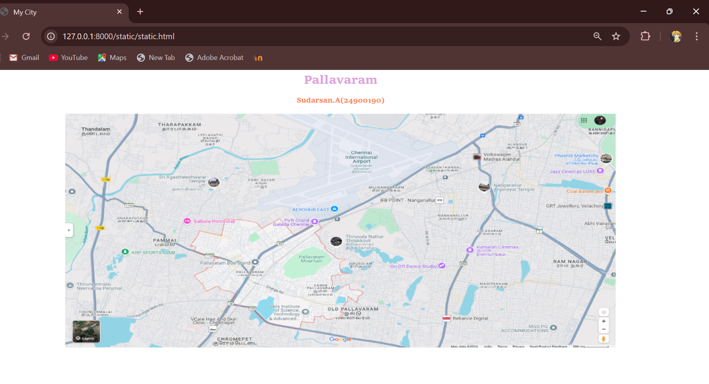
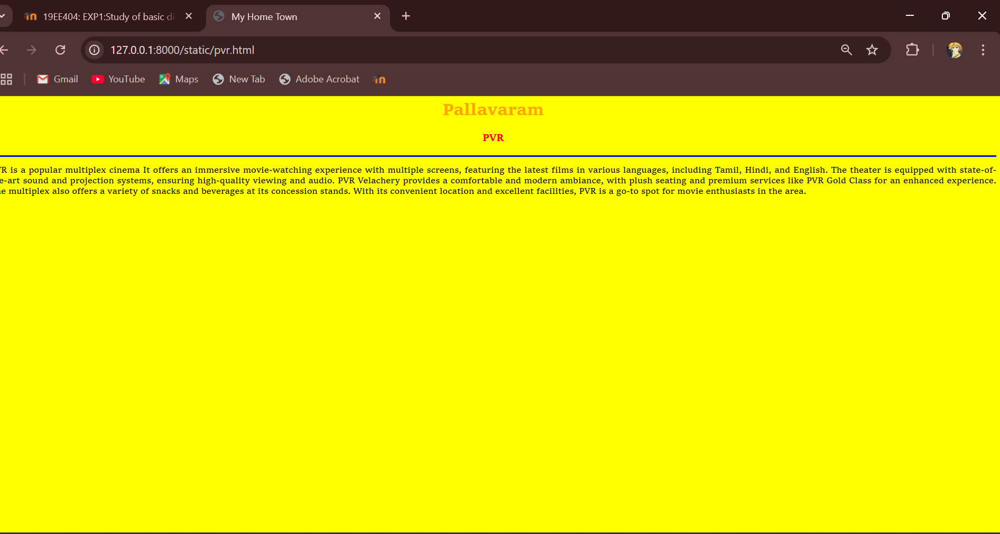
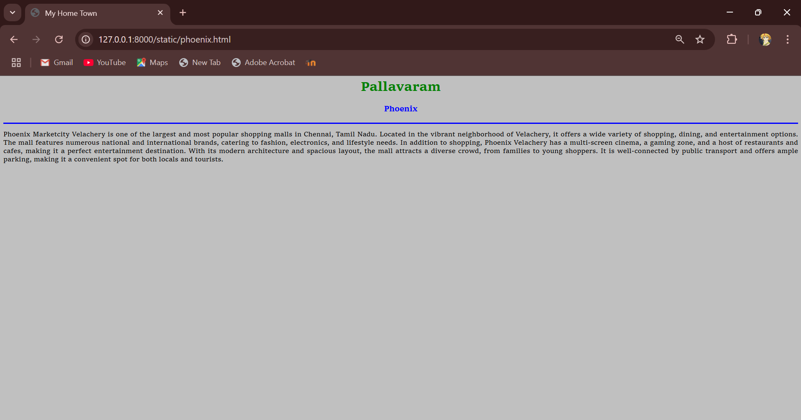
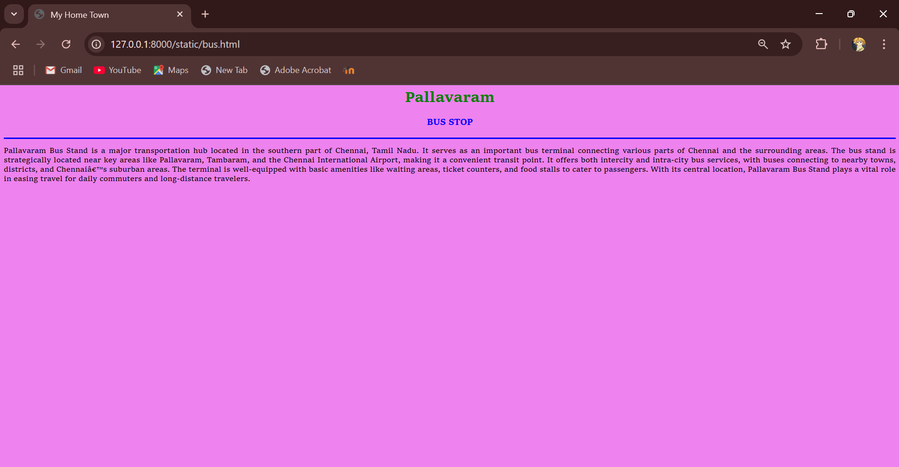
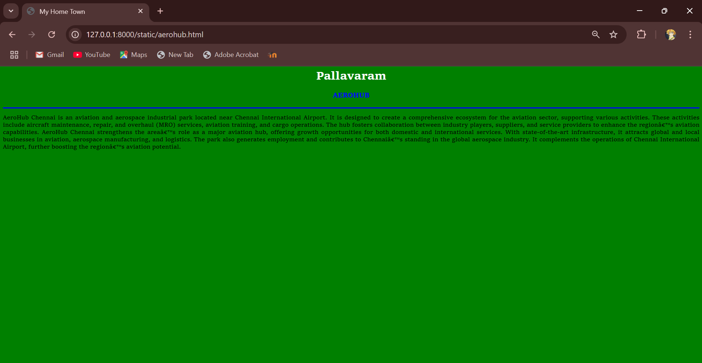
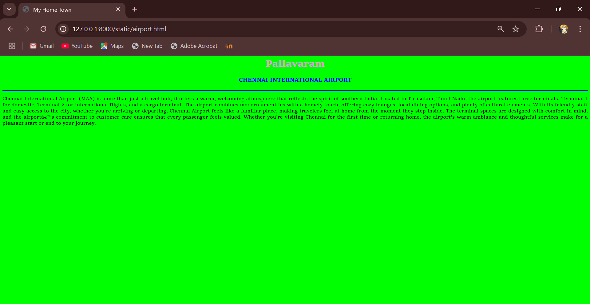

# Ex04 Places Around Me
## Date: 08/12/2024

## AIM
To develop a website to display details about the places around my house.

## DESIGN STEPS

### STEP 1
Create a Django admin interface.

### STEP 2
Download your city map from Google.

### STEP 3
Using ```<map>``` tag name the map.

### STEP 4
Create clickable regions in the image using ```<area>``` tag.

### STEP 5
Write HTML programs for all the regions identified.

### STEP 6
Execute the programs and publish them.

## CODE

```
Static.html
<html>
<head>
<title>My City</title>
</head>
<body>
<h1 align="center">
<font color="plum"><b>Pallavaram</b></font>
</h1>
<h3 align="center">
<font color="coral"><b>Sudarsan.A(24900190)</b></font>
</h3>
    <center>
        
        <map name="MyCity">
            <area target="" alt="aerohub" title="aerohub" href="aerohub.html" coords="620,210,450,270" shape="rect">
            <area target="" alt="pvr" title="pvr" href="pvr.html" coords="600,200,550,300" shape="rect">
            <area target="" alt="bus" title="bus" href="bus.html" coords="370,381,450,400" shape="rect">
            <area target="" alt="phoenix" title="phoenix" href="phoenix.html" coords="1377,44,1629,150" shape="rect">
            <area target="" alt="airport" title="airport" href="airport.html" coords="440,5,150,5" shape="rect">
        </map>
    </center>
</body>
</html>

Pvr.html
<html>
<head>
<title>My Home Town</title>
</head>
<body bgcolor="yellow">
    <h1 align="center">
    <font color="orange"><b>Pallavaram</b></font>    
    </h1>
    <h3 align="center">
    <font color="red"><b>PVR</b></font>    
    </h3>
    <hr size="3" color="blue">
    <p align="justify">
    <front face="Georgia" size="S">
        PVR is a popular multiplex cinema   
        It offers an immersive movie-watching experience with multiple screens, featuring the latest films in various languages, including Tamil, Hindi, and English.  
        The theater is equipped with state-of-the-art sound and projection systems, ensuring high-quality viewing and audio.  
        PVR Velachery provides a comfortable and modern ambiance, with plush seating and premium services like PVR Gold Class for an enhanced experience.  
        The multiplex also offers a variety of snacks and beverages at its concession stands.  
        With its convenient location and excellent facilities, PVR is a go-to spot for movie enthusiasts in the area.   
     </font>
     </p>      
    </body>
    </html>

Phoenix.html
<html>
<head>
    <title>My Home Town</title>
    </head>
    <body bgcolor="silver">
    <h1 align="center">
    <font color="green"><b>Pallavaram</b></font>    
    </h1>
    <h3 align="center">
    <font color="blue"><b>Phoenix</b></font>    
    </h3>
    <hr size="3" color="blue">
    <p align="justify">
    <front face="Georgia" size="S">
        Phoenix Marketcity Velachery is one of the largest and most popular shopping malls in Chennai, Tamil Nadu.  
        Located in the vibrant neighborhood of Velachery, it offers a wide variety of shopping, dining, and entertainment options.  
        The mall features numerous national and international brands, catering to fashion, electronics, and lifestyle needs.  
        In addition to shopping, Phoenix Velachery has a multi-screen cinema, a gaming zone, and a host of restaurants and cafes, making it a perfect entertainment destination.  
        With its modern architecture and spacious layout, the mall attracts a diverse crowd, from families to young shoppers.  
        It is well-connected by public transport and offers ample parking, making it a convenient spot for both locals and tourists.
     </font>
     </p>      
    </body>
    </html>

bus.html
<html>
<head>
<title>My Home Town</title>
</head>
<body bgcolor="violet">

<h1 align="center">
    <font color="green"><b>Pallavaram</b></font>    
    </h1>
    <h3 align="center">
    <font color="blue"><b>BUS STOP</b></font>    
    </h3>
    <hr size="3" color="blue">
    <p align="justify">
    <front face="Georgia" size="S">
        Pallavaram Bus Stand is a major transportation hub located in the southern part of Chennai, Tamil Nadu.  
        It serves as an important bus terminal connecting various parts of Chennai and the surrounding areas.  
        The bus stand is strategically located near key areas like Pallavaram, Tambaram, and the Chennai International Airport, making it a convenient transit point.  
        It offers both intercity and intra-city bus services, with buses connecting to nearby towns, districts, and Chennai’s suburban areas.  
        The terminal is well-equipped with basic amenities like waiting areas, ticket counters, and food stalls to cater to passengers.  
        With its central location, Pallavaram Bus Stand plays a vital role in easing travel for daily commuters and long-distance travelers.   
     </font>
     </p>      
    </body>
</html> 

aerohub.html
<html>
<head>
<title>My Home Town</title>
</head>
<body bgcolor="green">
<h1 align="center">
<font color="white"><b>Pallavaram</b></font>    
</h1>
<h3 align="center">
<font color="blue"><b>AEROHUB</b></font>    
</h3>
<hr size="3" color="blue">
<p align="justify">
    <front face="Georgia" size="S">
        AeroHub Chennai is an aviation and aerospace industrial park located near Chennai International Airport.  
        It is designed to create a comprehensive ecosystem for the aviation sector, supporting various activities.  
        These activities include aircraft maintenance, repair, and overhaul (MRO) services, aviation training, and cargo operations.  
        The hub fosters collaboration between industry players, suppliers, and service providers to enhance the region’s aviation capabilities.  
        AeroHub Chennai strengthens the area’s role as a major aviation hub, offering growth opportunities for both domestic and international services.  
        With state-of-the-art infrastructure, it attracts global and local businesses in aviation, aerospace manufacturing, and logistics.  
        The park also generates employment and contributes to Chennai’s standing in the global aerospace industry.  
        It complements the operations of Chennai International Airport, further boosting the region’s aviation potential.   
     </font>
     </p>      
    </body>
    </html>
    <html>

airport.html
<html>
<head>
<title>My Home Town</title>
</head>
<body bgcolor="lime">
<h1 align="center">
<font color="plum"><b>Pallavaram</b></font>    
</h1>
<h3 align="center">
<font color="blue"><b>CHENNAI INTERNATIONAL AIRPORT</b></font>    
</h3>
<hr size="3" color="blue">
<p align="justify">
<front face="Georgia" size="S">
    Chennai International Airport (MAA) is more than just a travel hub; it offers a warm, welcoming atmosphere that reflects the spirit of southern India.
    Located in Tirusulam, Tamil Nadu, the airport features three terminals: Terminal 1 for domestic, Terminal 2 for international flights, and a cargo terminal.
    The airport combines modern amenities with a homely touch, offering cozy lounges, local dining options, and plenty of cultural elements.
    With its friendly staff and easy access to the city, whether you're arriving or departing, Chennai Airport feels like a familiar place, making travelers feel at home from the moment they step inside.
    The terminal spaces are designed with comfort in mind, and the airport’s commitment to customer care ensures that every passenger feels valued.
    Whether you're visiting Chennai for the first time or returning home, the airport's warm ambiance and thoughtful services make for a pleasant start or end to your journey.</font>
 </p>      
</body>
</html>
```


## OUTPUT











## RESULT
The program for implementing image maps using HTML is executed successfully.
